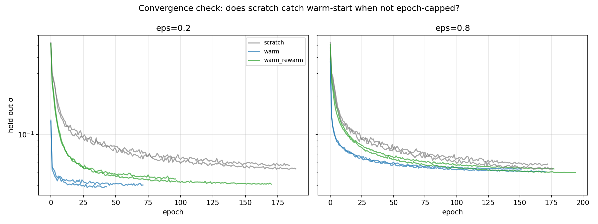

# cy-villages

**Warm-starting Calabi–Yau metric networks across a moduli space: one network per neighbourhood, not one per shape and not one for everything.**

Justus van Eijk · Numina Labs · September 2026 · MIT

---

## TL;DR

Training a neural Calabi–Yau metric (cymetric, PhiFS ansatz) on a *neighbourhood* of similar shapes gives you a "village specialist" that transfers to unseen shapes nearby:

- **Inside the village (ε ≈ 0.2):** one epoch of fine-tuning from the specialist reaches the accuracy that training from scratch reaches after ~185 epochs. At convergence, the warm-started network is still **1.4× better** (σ ≈ 0.039 vs 0.055) — scratch does not catch up.
- **At the village edge (ε ≈ 0.8):** warm-start and scratch converge to the same σ ≈ 0.05; warm-start just gets there 2–3× sooner.
- **The edge is a slope, not a cliff.** Zero-shot accuracy degrades smoothly with recipe distance, and warm-start beats an equal-budget scratch run at every radius we tested.
- **One network for the whole space does not work** at this scale: a shared generalist stalls at σ ≈ 0.45 whether initialised randomly or from a specialist. "Best-of-specialists" plus a router is the generalist.

Covering a moduli space is therefore an engineering problem — tile it with villages — not a modelling problem.

---

## Setup

- **Family:** bicubic hypersurface in ℙ² × ℙ² (bidegree (3,3)). A "recipe" is the vector of 100 complex coefficients, normalised to unit norm.
- **Model:** cymetric `PhiFSModel`, 4 × 256 GELU MLP on the 12 real ambient coordinates, Adam (legacy), two-phase epochs (batch 64 without volume-form learning, then one full-batch step with it).
- **Metric:** σ — the Ricci-flatness / Monge–Ampère error on 50 000 held-out sample points per shape. Lower is better. Fubini–Study is ≈ 0.3–0.4 on these shapes.
- **Villages:** four groups A–D, each 12 shapes generated as `base + 0.05·noise` around a random base recipe. One specialist network is trained for 25 epochs on all 12 shapes of a group.
- **Router:** each shape gets a six-number fingerprint — Fubini–Study σ, the spread of the sampling weights and of Ω, the max/mean weight ratio, and two statistics of the gradient of the defining polynomial at sampled points — and is routed to the village whose fingerprint centre is nearest. 12/12 correct on held-out shapes (three per village); strangers far from every village are flagged as such.
- **Perturbed shapes:** for the radius and convergence experiments, new recipes are generated as `base + ε·noise`, renormalised, with ε the perturbation radius. Recipe distance is reported modulo the overall phase.

Everything runs on a single Colab L4. Point sampling is CPU-bound and done once per shape; training is ~18 s/epoch.

---

## Results

### 1. Specialists work; a shared generalist does not

| | σ on own village | σ on unseen shape (warm-start, 10 ep) | σ on unseen shape (scratch, 10 ep) |
|---|---|---|---|
| Specialist (per village) | ≈ 0.045 | ≈ 0.025 | ≈ 0.16 |
| Shared generalist (all villages) | ≈ 0.45 | — | — |

The shared generalist stalls at σ ≈ 0.45 from both random init and specialist warm-start — roughly Fubini–Study, i.e. it has learned nothing shape-specific. Earlier attempts (v1/v2) to feed the recipe as an input to one network memorised the training shapes and did not transfer. Best-of-specialists via the router is the working generalist.


### 2. How far does a village extend?

Zero-shot σ (specialist applied directly to a perturbed shape) and warm-start best-of-10-epochs, village A, two shapes per radius:

| ε | recipe dist | zero-shot | warm-start (10 ep) | scratch (10 ep) |
|---|---|---|---|---|
| 0.02 | 0.020 | 0.037 | 0.024 | 0.17 |
| 0.05 | 0.050 | 0.047 | 0.025 | 0.16 |
| 0.1 | 0.10 | 0.073 | 0.029 | 0.16 |
| 0.2 | 0.20 | 0.128 | 0.040 | 0.16 |
| 0.4 | 0.38 | 0.23 | 0.060 | 0.16 |
| 0.8 | 0.66 | 0.38 | 0.088 | 0.16 |

Village D replicates this to within noise. Zero-shot beats scratch out to ε ≈ 0.2–0.25; warm-start beats scratch at every radius tested. The degradation is smooth — there is no radius at which the specialist suddenly becomes useless.


At a 30-epoch budget the picture is the same: warm-start stays 1.6–3× ahead of scratch across ε = 0.05–0.4.


**A correction to the scratch column.** The 10-epoch scratch value of σ ≈ 0.16 was obtained under a fast learning-rate decay (halving every ~3 epochs) that hurts a randomly-initialised network far more than a warm-started one: under a slower decay, scratch reaches 0.12–0.13 by epoch 10, while warm-start is ≈ 0.04 at epoch 10 under either schedule. The equal-budget comparisons above are therefore tilted in warm-start's favour. Section 3 is the comparison that should be read instead.

### 3. Does scratch catch up if you stop capping epochs?

This was the obvious objection to Section 2, so we ran it. Every arm trained with early stopping (patience 15 epochs, min-delta 10⁻⁴, ceiling 300 epochs) under the same LR-decay *shape* stretched over the 300-epoch ceiling. Two shapes at ε = 0.2, two at ε = 0.8, village A. Best σ (epoch stopped):

| shape | scratch | warm-start | warm + shrink-perturb |
|---|---|---|---|
| ε=0.2, #0 | 0.056 (184) | **0.040** (71) | 0.045 (96) |
| ε=0.2, #1 | 0.053 (189) | **0.038** (43) | 0.041 (170) |
| ε=0.8, #0 | 0.057 (172) | 0.053 (151) | 0.053 (177) |
| ε=0.8, #1 | 0.053 (176) | 0.051 (170) | 0.050 (194) |

**Inside the village (ε = 0.2), scratch does not catch up.** It plateaus at σ ≈ 0.055 after ~185 epochs. The warm-started network plateaus at σ ≈ 0.039 after 40–70 epochs — a better solution, not merely a faster one. Warm-start at *epoch 1* (σ = 0.053–0.055) already matches scratch's fully converged value.

**At the edge (ε = 0.8), it's a tie.** All arms converge to σ ≈ 0.05–0.057, within shape-to-shape noise (scratch alone spans 0.053–0.057 across the four shapes). Warm-start still reaches any given σ 2–3× sooner, but the quality advantage is gone. Somewhere between ε = 0.2 and 0.8 the village stops giving a better answer and only gives a faster one.

**No inherited-basin pathology.** Warm-starting can trap an optimiser in a poor basin inherited from the source task (Ash & Adams, *On warm-starting neural network training*, NeurIPS 2020). We checked with their proposed fix — shrink weights by 0.5 and add N(0, 0.01) noise before fine-tuning. It never beat plain warm-start: worse at ε = 0.2, tied at ε = 0.8. The specialist's weights are a genuine head start, not a trap.



---

## What this means

1. **Tile the landscape.** A village of radius ε ≈ 0.2 in recipe space gives converged-quality metrics for any shape inside it after a handful of fine-tuning epochs. Coverage is a question of how many villages you can afford to seed, not whether transfer works.
2. **Don't build one big model yet.** At this capacity the shared generalist learns nothing. Whether a much larger network or a different conditioning scheme changes that is open; the router-plus-specialists design sidesteps it.
3. **Report converged baselines.** The 10-epoch scratch numbers in Section 2 overstate the gap by a factor of ~3. The honest gap is 1.4× at convergence inside the village and ~200× in epochs-to-reach-it. Both are worth having; only the second is large.

---

## Limitations

- One family (bicubic), one village studied to convergence (A), two shapes per radius. Village D replicates the fixed-budget results only.
- The village boundary is bracketed (between ε = 0.2 and 0.8), not located.
- "Recipe distance" is Euclidean on normalised coefficients modulo phase; it is not a moduli-space metric and is not invariant under the full symmetry group of the ambient space.
- σ measures Ricci-flatness on sample points; nothing here is validated against a known exact metric or a downstream physical quantity.
- No hyperparameter search on the specialist architecture.

---

## Reproduce

```
scripts/moduli_net_v5.py   # villages A–D, specialists, router, held-out tests (Section 1)
scripts/radius.py          # Section 2 (--base=A|B|C|D, --long for the 30-epoch budget)
scripts/convergence.py     # Section 3 (--base=A; early stopping, 300-epoch ceiling)
results/*.csv              # the logs behind every table above
```

Each script caches sampled points under `moduli_data_*/` and appends to a CSV log, so an interrupted run resumes. Sampling 50 000 points per shape is the slow step and is CPU-bound; training is ~18 s/epoch on an L4.

Environment: cymetric from GitHub in a Python 3.11 venv with CUDA 11 pip wheels — see `notebooks/` for the exact pins.

---

## Next

- Replicate Sections 2–3 on a second family (quintic or a CICY) to check the village picture isn't bicubic-specific.
- Locate the village boundary (ε = 0.3, 0.4, 0.5, 0.6 to convergence).
- Downstream: Yukawa couplings / mass ratios on a three-generation ℤ₃×ℤ₃ quotient of the bicubic, where the metric's accuracy actually cashes out.

Contact: justus@numinalabs.app