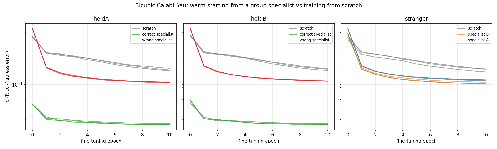
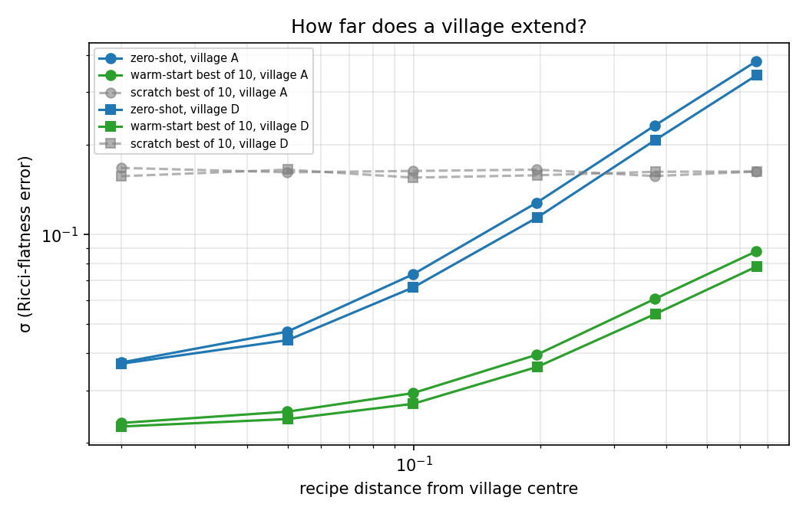
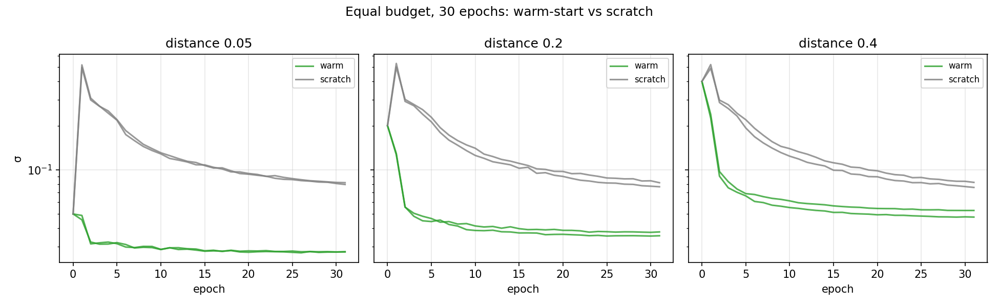

# Villages in the string landscape: warm-starting Calabi-Yau metrics across a family

**Justus van Eijk. Numina Labs, Amsterdam. September 2026. Draft v1.**

---

## The short version

If string theory is right, the six extra dimensions are curled up into a Calabi-Yau shape, and that shape decides the particle masses. To get from a shape to its masses you need the shape's metric. There is no formula for it. People approximate it with neural networks, one shape at a time, from scratch, hours per shape.

I wanted to know one thing: if you train a network on a bunch of shapes that look alike, does it help on a new shape that also looks like them?

It does. On the bicubic family:

- A "specialist" trained on 12 nearby shapes gets to a Ricci-flatness error of σ ≈ 0.045 on its own group.
- On a shape it has never seen from the same neighbourhood, it starts at σ ≈ 0.05 with zero training and gets to 0.025 after 10 epochs. From scratch you get 0.16 in those 10 epochs, and 0.08 in 30.
- A neighbourhood is wide. Zero-shot beats 10 epochs of scratch up to about 25% recipe distance. Warm-starting beats scratch at every distance I tested, at equal budget, on two independent neighbourhoods.
- Deciding which specialist a new shape belongs to is trivial: nearest neighbour in coefficient space. 12 out of 12. No trained model needed.
- One network shared across unrelated neighbourhoods does not work. I tried it twice. The reason is structural, not a setting.

Everything is in this repo: scripts in `scripts/`, logs in `results/`, specialist weights in `weights/`, figures in `figures/`.

---

## 1. Why I did this

Superstring theory needs ten dimensions. We see four, so six are curled up small, into a Calabi-Yau shape. The shape fixes the physics: particle masses come from overlap integrals of wavefunctions living on it. To compute those you need the Ricci-flat metric of the shape. Yau proved in 1977 that it exists. Nobody has ever written one down. Since around 2020 people approximate it with neural nets (before that, Donaldson's algorithm), and that works, but it's one shape at a time and you start from nothing every time.

There are something like 10⁵⁰⁰ candidate vacua. The Kreuzer-Skarke list alone has 473 million Calabi-Yau recipes. If you ever want to scan the landscape, the metric step has to be cheap. That's what this note is about.

I'm a second-year AI student, not a string theorist. I started this eight days ago after watching a video about it with a friend. So take the physics framing with that in mind. The numbers are the numbers.

---

## 2. Setup

**Family.** Bicubic Calabi-Yau: one equation of bidegree (3,3) in ℙ²×ℙ². 100 monomials, so a "recipe" is 100 complex coefficients, normalised to length 1. Same topology for every shape in the family. It gives 81 families of particles, not 3, so this is a training ground, not a candidate for our universe. The ℤ₃×ℤ₃ quotient that gives 3 families is a later step.

**Metric model.** `cymetric` (Larfors, Lukas, Ruehle, Schneider). The network takes a point on the shape (12 real numbers) and outputs a correction φ to the Fubini-Study Kähler potential. The loss is how badly Ricci-flatness is violated. 4 layers of 256, GELU. Two-phase training per epoch like in the cymetric paper. Adam, learning rate decaying by half every third of the run. 50,000 sampled points per shape, 10% held out for evaluation.

**Error measure.** σ, the cymetric sigma-measure. Basically the average over held-out points of |1 − det(g)/|Ω|²|. σ = 0 means exactly Ricci-flat. Published single-shape results sit around 0.01 to 0.02.

**Villages.** Take a random base recipe c₀. A neighbour is c₀ + ε·n with n random, then renormalised. ε = 0.05 for training and held-out neighbours. Four bases A, B, C, D. 12 training neighbours each, 3 held-out neighbours each. Plus six "strangers": random recipes not related to any base.

**Recipe distance.** ‖c₁·e^{iθ} − c₂‖ minimised over the overall phase θ. This ignores the 18 coordinate-change directions in coefficient space. See limitations.

Everything ran on a Colab L4. Point sampling on a MacBook. Total compute for this whole note: about 20 GPU-hours.

---

## 3. Results

### 3.1 Specialists

One network per village, trained on its 12 neighbours at the same time (same weights, each shape has its own loss), 25 epochs.

| Village | σ after 25 epochs |
|---|---|
| A | 0.045 |
| B | 0.050 |
| C | 0.044 |
| D | 0.044 |

For comparison: one shape trained alone for 25 to 30 epochs gets to about 0.08. So training on 12 shapes at once is not a compromise. It's better per shape than training on one.

### 3.2 Transfer to shapes it never saw

*Figure 1. Fine-tuning curves on held-out shapes from villages A and B, and on strangers. Three tiers: right village (green), wrong village or stranger (red/blue/orange), nothing (gray).*

Every held-out neighbour, three ways, 10 epochs each: from scratch, warm from the right specialist, warm from a wrong one.

| | start | best of 10 epochs |
|---|---|---|
| scratch | ~0.5 | 0.159 to 0.181 |
| right specialist | 0.043 to 0.059 | **0.024 to 0.026** |
| wrong specialist | 0.55 to 0.70 | 0.106 to 0.113 |

Twelve shapes, four villages, no exceptions. The right specialist's zero-shot number beats scratch's best after ten epochs by 3×. After fine-tuning it's 6× better.

The wrong specialist is interesting. It starts worse than scratch, because it confidently applies the wrong geometry. Then it recovers to 0.11, which is better than scratch but nowhere near the right doctor. The six strangers land at the same 0.10 to 0.11 from any specialist. So a specialist knows two things: bicubics in general, which is worth 0.16 → 0.11 anywhere, and its own village, which is worth 0.11 → 0.025 nearby.

### 3.3 Routing

Three ways to decide which specialist a new shape belongs to, tested on the 12 held-outs:

| Router | Correct | Needs |
|---|---|---|
| Try-on: evaluate σ under each specialist, pick the lowest | 12/12 | the specialists |
| Recipe distance: nearest village centre in coefficient space | 12/12 | nothing |
| Hand-made geometric fingerprint (4 to 6 summary stats) | 11/12 | a sampler |

The try-on gap is huge (0.05 vs 0.6), so routing is not a hard problem. Recipe distance is the one to use. It works before you've computed anything.

### 3.4 How wide is a village?

*Figure 2. Error vs recipe distance from the village centre, two independent villages. Zero-shot (blue) crosses the 10-epoch scratch line (gray) near 0.25. Warm-start (green) never does.*

Shapes at increasing distance from a base. Zero-shot, then 10 epochs warm vs scratch. Two shapes per distance, two independent bases.

| distance | zero-shot A / D | warm-best A / D | scratch-best |
|---|---|---|---|
| 0.02 | 0.037 / 0.037 | 0.024 / 0.023 | 0.16 |
| 0.05 | 0.048 / 0.044 | 0.025 / 0.024 | 0.16 |
| 0.10 | 0.074 / 0.067 | 0.029 / 0.027 | 0.16 |
| 0.20 | 0.128 / 0.114 | 0.040 / 0.036 | 0.16 |
| 0.40 | 0.233 / 0.208 | 0.061 / 0.055 | 0.16 |
| 0.80 | 0.381 / 0.343 | 0.088 / 0.079 | 0.16 |

No cliff. Zero-shot crosses scratch's 10-epoch best at roughly 25% distance. Warm-best goes down roughly linearly, about 0.025 + 0.08·distance, and never loses. A and D agree everywhere within noise.

### 3.5 Equal budget

*Figure 3. Thirty epochs each. Scratch keeps improving. Warm-start plateaus around epoch 8 but stays 1.6 to 3× ahead. The scratch spike at epoch 1 is the two-phase trainer's first large-batch step.*

Obvious objection: scratch at 10 epochs is a straw man. So: 30 epochs each, warm vs scratch, base A.

| distance | warm-best (30 ep) | scratch-best (30 ep) | ratio |
|---|---|---|---|
| 0.05 | 0.027 | 0.080 | 3.0× |
| 0.20 | 0.036 | 0.080 | 2.2× |
| 0.40 | 0.050 | 0.079 | 1.6× |

Scratch does catch up partly. It halves its error between 10 and 30 epochs, and warm-start doesn't improve past 10 epochs at this learning rate. So the claim is this: **warm-starting reaches in 10 epochs what scratch hasn't reached in 30, and keeps a 1.6 to 3× edge at equal budget across the whole range.** Whether scratch fully catches up at 100+ epochs, I haven't tested.

### 3.6 What didn't work

**One "generalist" network across villages.** I tried this three ways. (i) 16 random bicubics, recipe glued onto the input: the training shapes improve, unseen shapes get worse over training (0.47 → 0.49). (ii) Same thing with FiLM conditioning and physics-motivated features (each monomial evaluated at the point): same result, slower. (iii) All 48 village shapes, one network, initialised from specialist A: σ = 0.449 after one epoch. One pass over four villages erased everything A knew.

In hindsight the reason is simple. The network only sees a point in the ambient space. All bicubics live in the same ℙ²×ℙ², so a point near shape 1 is also near shape 2, and the two shapes want different corrections there. Inside a village the corrections agree, so a shared network works. Across villages they conflict and average out to nothing. Any generalist has to know which shape it's on, as an input. The versions that did know still failed from random init. What I haven't tried is conditioning plus a specialist start, trained village by village. That's v6.

For now the working generalist is best-of-specialists: try all of them, keep the lowest. Costs one forward pass per specialist.

---

## 4. Limitations

1. **One family.** All of this is bicubics. It needs checking on a family built differently: the quintic, a CICY with several equations, a toric hypersurface. The machinery is the same. The recipe encoding is not.
2. **Distance ignores direction.** Perturbations are random in all 100 directions at once. Some directions are known to be nasty (going toward singular shapes, like ψ → large on the quintic, doubles the error). So the "radius" is an average over directions, not a guarantee.
3. **Some of the distance is fake.** 18 of the 100 coefficient directions are coordinate changes, not real shape changes. My recipe distance counts them. So the true moduli-space radius is a bit smaller than the numbers above.
4. **σ is an average.** Particle masses come from integrals that can be dominated by small regions of the shape. A shape with σ = 0.025 could be much worse locally. Nobody in the field has a good answer for this yet.
5. **n is small.** 2 to 3 shapes per condition. The effects are 3 to 6× so this isn't a significance problem, but the slope in 3.4 is a six-point fit.
6. **Warm-start plateau.** The fine-tuning learning rate (3×10⁻⁴) is probably too gentle. Warm runs stop improving around epoch 8. The floor might be lower than 0.025.

---

## 5. What this gets you, and what's still missing

The point of a cheap metric step is a scan. Thousands of candidate shapes → metrics → particle couplings → eliminate → repeat on the survivors at higher resolution. This note is about the first arrow. With villages, a new shape in a covered region costs 10 epochs (minutes on a GPU) instead of hours, and routing is free. A region is covered once villages are spaced 20 to 40% apart, at one specialist each (1.5 GPU-hours).

Still missing, in order:

**v6, a conditioned generalist.** FiLM-conditioned network, initialised from a specialist, trained village by village. If it holds four villages without forgetting, it replaces best-of-specialists with one model. If not, best-of-specialists is fine and this is closed.

**Other families.** Quintic and a CICY with three equations. Same scripts, a week each. Three families with the same pattern is a paper. One is a demo.

**Direction-aware radius and a proper moduli distance.** Perturb along specific directions instead of randomly. Quotient out the coordinate-change directions. This tells us if villages are balls or ellipsoids and where to put them.

**One physical number.** Take the ℤ₃×ℤ₃ quotient of the bicubic with a known heterotic line-bundle model (Anderson, Gray, Lukas, Palti). Run metric → harmonic forms → Yukawa couplings with `cymyc`. Reproduce a quark-mass ratio from the 2024/25 papers. Even a rough match would be the first time this pipeline touches actual physics. This is the milestone I want before talking to anyone senior.

**Then scale.** Cluster time, hundreds of villages, the region where the three-family candidates live. That's a grant, not a laptop.

---

## 6. Reproducing this

See `docs/REPRODUCE.md` for the order of runs. Summary:

- `scripts/sample_overnight.py` samples all village and stranger shapes (CPU, about 1 minute per shape on an M-series Mac).
- `scripts/moduli_net_v4.py`: two villages, specialists, warm vs scratch vs wrong specialist. Checkpointed.
- `scripts/moduli_net_v5.py`: four villages, three routers, best-of-specialists, strangers.
- `scripts/radius.py`: radius curves (`--base=A/D`) and the equal-budget test (`--long`).
- `notebooks/cy_v4_colab.ipynb`: Colab environment (Python 3.11 via uv, TF 2.14 + CUDA 11 libs).

All logs (`results/*.csv`) and specialist weights (`weights/specialist_*.weights.h5`) are here. Seeds are fixed. The tables above should reproduce to the third decimal.

---

## Thanks

`cymetric` by Larfors, Lukas, Ruehle and Schneider. None of this runs without it. I built everything here in conversation with Claude (Anthropic). The questions, the experiments and the mistakes are mine.
